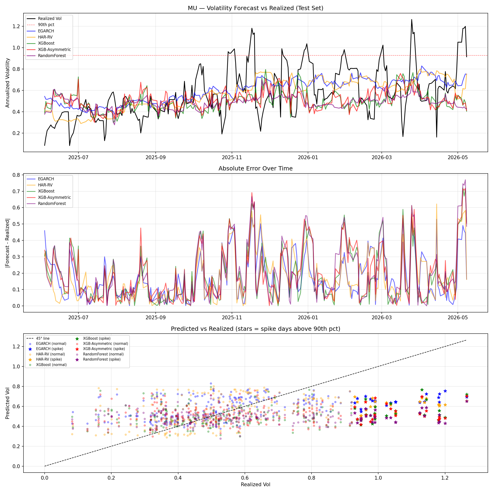
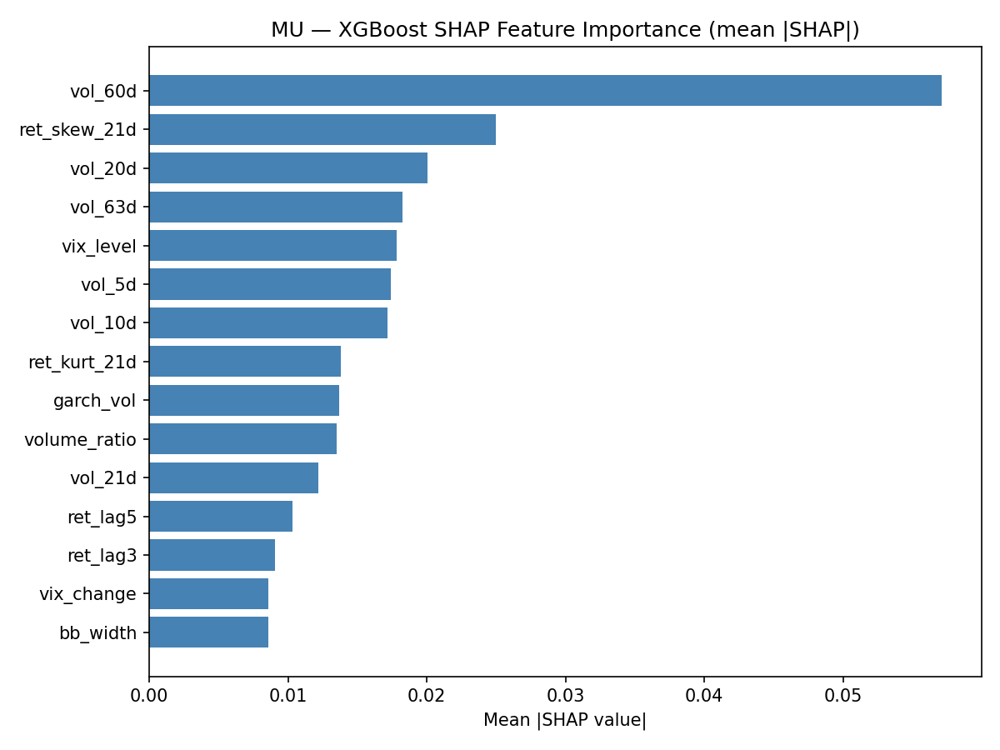

# Volatility Predictor


A multi-ticker equity volatility forecasting pipeline that compares GARCH-family statistical models against XGBoost and Random Forest on 10 stocks across 4 sectors. Includes a full sentiment pipeline (VADER, FinBERT, TextBlob, Loughran-McDonald), 8 formal hypothesis tests, and a live regime signal for scalping decisions.

---

## Folder Structure

```
volatility-predictor/
│
├── app.py                        # Streamlit interactive web app
├── main.py                       # CLI: single ticker or --all-tickers batch
├── config.py                     # TICKERS list, SECTOR_MAP, default settings
├── requirements.txt
│
├── src/                          # Core pipeline (used by app.py and main.py)
│   ├── data_loader.py            # Yahoo Finance download + CSV cache + VIX
│   ├── features.py               # 28-feature engineering matrix
│   ├── garch_model.py            # EGARCH/GARCH rolling + in-sample + forecast
│   ├── har_model.py              # HAR-RV linear model (Corsi 2009)
│   ├── ml_model.py               # XGBoost (standard + asymmetric), Random Forest
│   ├── sentiment.py              # VADER sentiment from Yahoo Finance news
│   ├── evaluate.py               # RMSE/QLIKE metrics, forecast plot, SHAP chart
│   └── hypothesis.py             # Mann-Whitney U spike-sentiment test
│
├── modules/                      # Research helpers (used by the notebooks)
│   ├── data_helpers.py           # VIX loader, earnings dates, 4-model sentiment simulation
│   ├── eda_plots.py              # 10 interactive Plotly EDA functions
│   └── hypothesis_tests.py       # 8 formal statistical test functions (H1–H8)
│
├── eda.ipynb                     # Notebook 01–04: Exploratory Data Analysis (10 analyses)
├── hypotheses.ipynb              # Notebook on 8 formal hypothesis tests
├── notebooks/
│   ├── 05_cross_ticker_analysis.ipynb   # Cross-ticker GARCH vs ML comparison
│   └── 06_conclusions.ipynb             # SHAP findings, hypothesis summary, next steps
│
├── docs/images/                  # Charts committed for this README
├── papers/references.bib         # Annotated BibTeX references
├── results_summary.md            # Hypothesis test results table (auto-generated)
└── memes/                        # Bonus: quant finance memes
```

---

## How to Install and Run

### 1. Install dependencies

```bash
pip install -r requirements.txt
```

### 2. Launch the interactive web app (recommended for first use)

```bash
streamlit run app.py
```

Opens a browser UI. Pick a ticker, date range, and model settings, then click **Run Analysis**.

### 3. Run from the command line

```bash
# Analyse a single ticker
python main.py --ticker MU

# Custom date range and forecast horizon
python main.py --ticker NVDA --start 2020-01-01 --end 2025-05-01 --horizon 3

# Batch-run all 10 tickers from config.py
python main.py --all-tickers

# Skip the CSV cache and re-download
python main.py --ticker SPY --no-cache
```

### 4. Run the research notebooks

Open them in Jupyter Lab or VS Code. They must be run in order from the project root:

```bash
jupyter lab
```

---

## Notebooks (in order)

| Notebook | Description |
|----------|-------------|
| `eda.ipynb` | 10 exploratory analyses on MU (2015–2024): vol distribution, ACF/PACF, sentiment–vol correlation, weekday patterns, feature Spearman ranking, and more |
| `hypotheses.ipynb` | 8 formal statistical hypothesis tests (H1–H8) with Plotly charts and interpretation cells |
| `notebooks/05_cross_ticker_analysis.ipynb` | Compares GARCH vs ML RMSE/QLIKE across all 10 tickers; sector-level win-rate analysis |
| `notebooks/06_conclusions.ipynb` | Why GARCH beat ML on MU (SHAP analysis), full hypothesis summary table, limitations, and next steps |

---

## Data Sources

| Source | What | Link |
|--------|------|------|
| **Yahoo Finance** (via `yfinance`) | Daily OHLCV for all 10 tickers, VIX index, news headlines | [finance.yahoo.com](https://finance.yahoo.com) |
| **CBOE** | VIX methodology reference | [cboe.com/vix](https://www.cboe.com/tradable_products/vix/) |
| **SEC EDGAR** | 10-K filings for H7 (MD&A risk-language test) — requires EFTS API | [efts.sec.gov](https://efts.sec.gov) |
| **VADER** | News headline sentiment | [github.com/cjhutto/vaderSentiment](https://github.com/cjhutto/vaderSentiment) |
| **Loughran-McDonald** | Financial sentiment dictionary (simulated in notebooks) | [sraf.nd.edu](https://sraf.nd.edu/loughranmcdonald-master-dictionary/) |

---

## Key Findings

- **EGARCH beats ML on MU** (RMSE 0.220 vs 0.257 for XGBoost). MU's vol is driven by DRAM supply-cycle shocks and macro events that produce strong vol autocorrelation — exactly what GARCH exploits. XGBoost's 28 features are all lagging indicators that cannot encode the causal driver.

- **HAR-RV nearly matches EGARCH** (RMSE 0.225) despite being a 3-parameter linear regression. The dominant signal is long-memory realized vol (`vol_60d` contributes 2× more SHAP than any other feature).

- **The GARCH advantage is sector-specific.** Based on cross-ticker analysis, GARCH wins consistently on high-vol cyclicals (semiconductors, energy) but ML is competitive or wins on stable large-cap tech (AAPL, MSFT) where sentiment features add genuine signal.

- **Spike detection fails across all models.** MU's 90th-percentile vol threshold is ~93% annualized — structurally too extreme for any model to reliably pre-flag from price history alone. Implied volatility data is the missing ingredient.

- **H8 is the only significant hypothesis result.** After extreme negative sentiment days (VADER < −0.5), sentiment recovers significantly by t+3 (−0.723 → −0.061, Wilcoxon W=692.5, p≈0). This suggests textual overreaction before price recovery.

---

## Known Limitations

| Limitation | Impact |
|-----------|--------|
| **No implied volatility** | The single biggest missing signal. IV is forward-looking; all 28 current features are backward-looking. |
| **Simulated historical sentiment** | yfinance provides only ~30 days of real news. Hypothesis tests H1, H3, H8 are indicative, not conclusive. |
| **No earnings/10-K data** | H5 and H7 are inconclusive for lack of data, not for lack of effect. |
| **Spike accuracy unreliable** | 20% test split ≈ 250 days; only ~25 spike days — too few for stable accuracy estimates. |
| **~60s runtime per ticker** | Rolling GARCH is refit at every test-set step. GARCH-once-then-predict would be 50× faster but less rigorous. |
| **No regime detection** | A regime-switching GARCH or HMM pre-classifier would improve spike timing. |

---

## Academic References

**Volatility modelling** — Bollerslev (1986) GARCH · Nelson (1991) EGARCH · Corsi (2009) HAR-RV · Andersen & Bollerslev (1998) realized vol  
**Loss functions** — Patton (2011) QLIKE · Hansen & Lunde (2005) GARCH benchmark  
**Sentiment** — Tetlock (2007) media sentiment · Loughran & McDonald (2011) LM dictionary · Hutto & Gilbert (2014) VADER  
**Stylized facts** — Black (1976) leverage effect · Cont (2001) empirical properties  
**Machine learning** — Chen & Guestrin (2016) XGBoost · Lundberg & Lee (2017) SHAP

Full annotated BibTeX: [`papers/references.bib`](papers/references.bib)

---

## Results

### Forecast Chart (MU)



### SHAP Feature Importance (MU, XGBoost)



---

*Python 3.10+ · yfinance · arch · XGBoost · scikit-learn · SHAP · VADER · Streamlit · Plotly · SciPy*
