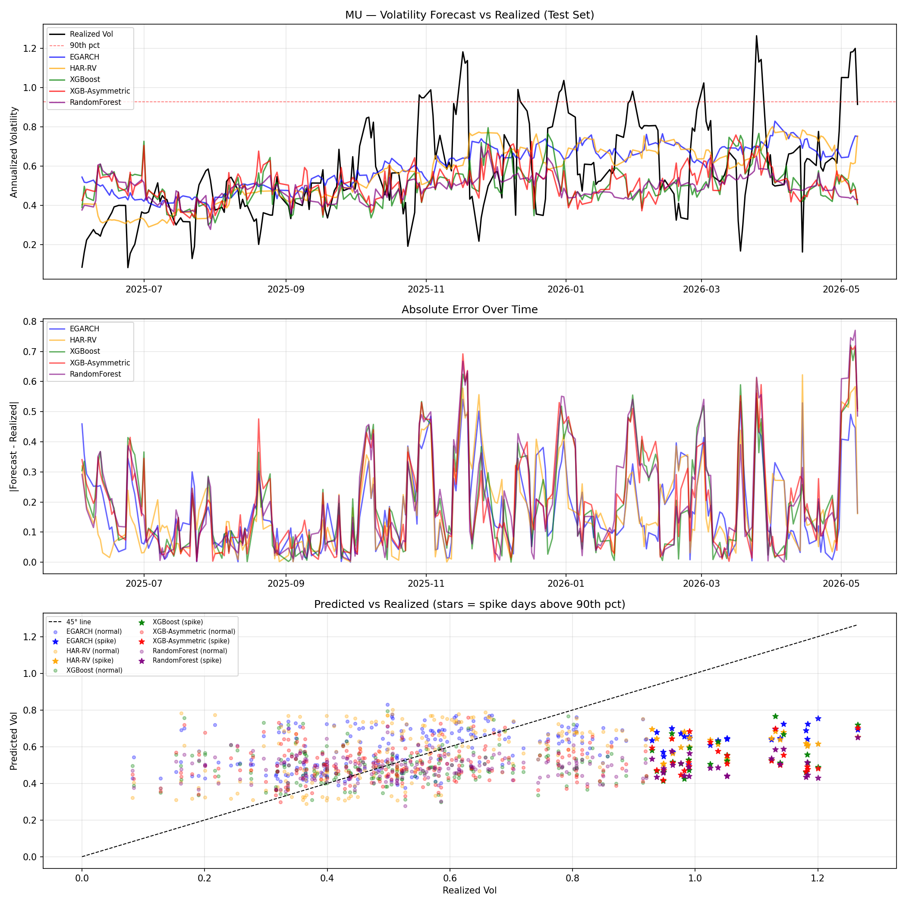
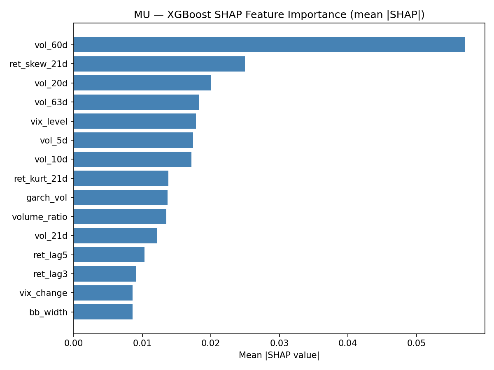

# Volatility Predictor


A multi-ticker equity volatility forecasting pipeline that compares GARCH-family
statistical models against machine-learning models (XGBoost, Random Forest, and a
Ridge stacking ensemble) across 10 stocks in 4 sectors. It ships a news + Reddit
sentiment pipeline, formal hypothesis tests, walk-forward validation, regime
analysis, a Streamlit web app, and a live regime signal for scalping decisions.

---

## Folder Structure

```
volatility-predictor/
│
├── app.py                  # Streamlit interactive web app
├── main.py                 # CLI: single ticker or --all-tickers batch
├── config.py               # TICKERS, sector maps, sector→model routing, defaults
├── requirements.txt
├── setup.cfg               # flake8 / autopep8 config
│
├── src/                    # Core library (used by app.py, main.py, scripts, tests)
│   ├── data_loader.py      # Yahoo Finance download + CSV cache + VIX
│   ├── data_helpers.py     # VIX loader, earnings dates, sentiment helpers
│   ├── features.py         # Feature-engineering matrix (returns, vols, RSI, VIX, sentiment)
│   ├── garch_model.py      # EGARCH/GARCH rolling + in-sample + forward forecast
│   ├── har_model.py        # HAR-RV linear model (Corsi 2009)
│   ├── ml_model.py         # XGBoost (standard + asymmetric), RF, quantile, stacking
│   ├── evaluate.py         # RMSE/MAE/QLIKE metrics, comparison plot, SHAP
│   ├── sentiment.py        # VADER sentiment (news + Reddit WSB)
│   ├── scraper_news.py     # News scraper across 8 free sources w/ additive cache
│   ├── sentiment_decomp.py # Sentiment-component decomposition
│   ├── hypothesis.py       # Spike-sentiment & disagreement hypothesis tests
│   ├── hypotheses.py       # 5 library-backed volatility hypothesis tests
│   ├── regime.py           # Volatility regime labelling + persistence
│   ├── regime_perf.py      # Per-regime model performance analysis
│   ├── walk_forward.py     # Walk-forward cross-validation
│   ├── validation.py       # Model validation / diagnostics
│   ├── diagnostics.py      # Diagnostic reports
│   ├── eda_plots.py        # Exploratory Plotly charts
│   ├── portfolio.py        # Portfolio-level volatility
│   ├── spillover.py        # Cross-asset volatility spillover
│   └── disagree_backtest.py# EGARCH-ML disagreement signal backtest
│
├── scripts/                # 20 standalone analysis runners (see Scripts below)
├── tests/                  # pytest suite (config, features, metrics, scraper, pipeline)
├── notebooks/              # eda, hypotheses, cross-ticker, conclusions
├── outputs/                # Generated metrics, plots, diagnostics, live-signal JSON
├── docs/images/            # Charts committed for this README
├── papers/references.bib   # Annotated BibTeX references
├── results_summary.md      # Hypothesis test results table
└── memes/                  # Bonus: quant finance memes
```

---

## How to Install and Run

### 1. Install dependencies

```bash
pip install -r requirements.txt
```

### 2. Launch the interactive web app (recommended for first use)

```bash
streamlit run app.py
```

Opens a browser UI. Pick a ticker, date range, and model settings, then click **Run Analysis**.

### 3. Run from the command line

```bash
# Analyse a single ticker (defaults: SPY, last 5 years, EGARCH, 5-day horizon)
python main.py --ticker MU

# Custom date range, forecast horizon, and GARCH variant
python main.py --ticker NVDA --start 2020-01-01 --end 2025-05-01 --horizon 3 --garch-type GARCH

# Batch-run all 10 tickers from config.py
python main.py --all-tickers

# Skip the CSV cache and re-download
python main.py --ticker SPY --no-cache
```

Each run writes a forecast chart, a metrics CSV, SHAP plots, and a structured
live-signal JSON under `outputs/`.

### 4. Run the tests

```bash
pytest -q
```

### 5. Run the research notebooks

Open `notebooks/` in Jupyter Lab or VS Code and run them in order from the project root:

```bash
jupyter lab
```

---

## CLI Options

| Flag | Default | Description |
|------|---------|-------------|
| `--ticker` | `SPY` | Single ticker to analyse |
| `--all-tickers` | off | Run every ticker in `config.TICKERS` |
| `--start` / `--end` | 5y ago / today | Analysis date range |
| `--horizon` | `5` | Forecast horizon in trading days |
| `--train-size` | `0.8` | Train/test split fraction |
| `--garch-type` | `EGARCH` | `GARCH` or `EGARCH` |
| `--no-cache` | off | Re-download instead of using cached CSVs |
| `--plot-dir` | `.` | Root for generated `outputs/` artifacts |

---

## Scripts

Standalone runners in `scripts/` for deeper analyses beyond the main pipeline. Run from the project root, e.g. `python scripts/run_walk_forward.py`.

| Script | Purpose |
|--------|---------|
| `daily_run.py` | Daily refresh of live signals across the ticker universe |
| `run_walk_forward.py` / `run_walkforward_viz.py` | Walk-forward CV and its visualisation |
| `run_validation.py` | Model validation and diagnostics |
| `run_oos_tickers.py` / `run_etf_universe.py` | Out-of-sample tickers and sector-ETF generalisation |
| `run_regime_perf.py` / `run_persistence_baseline.py` | Regime-level performance and persistence baselines |
| `run_market_sentiment.py` / `run_sentiment_decomp.py` | Market-wide sentiment and sentiment decomposition |
| `run_disagree_backtest.py` | EGARCH-ML disagreement signal backtest |
| `run_portfolio_vol.py` / `make_portfolio_summary.py` | Portfolio volatility and summary report |
| `run_spillover.py` | Cross-asset volatility spillover |
| `run_vrp_analysis.py` / `run_vix_term_structure.py` | Variance-risk-premium and VIX term structure |
| `run_jump_egarch.py` | Jump-augmented EGARCH |
| `run_spy_deep_dive.py` / `run_jpm_msft_diagnosis.py` | Single-name deep dives |
| `run_diagnostics.py` | General diagnostic report |

---

## Data Sources

| Source | What | Link |
|--------|------|------|
| **Yahoo Finance** (via `yfinance`) | Daily OHLCV for all tickers, VIX index, news headlines | [finance.yahoo.com](https://finance.yahoo.com) |
| **8 free news feeds** (via `scraper_news.py`) | Headline scraping with additive cache | — |
| **Reddit r/wallstreetbets** | WSB sentiment proxy | [reddit.com/r/wallstreetbets](https://www.reddit.com/r/wallstreetbets/) |
| **CBOE** | VIX methodology reference | [cboe.com/vix](https://www.cboe.com/tradable_products/vix/) |
| **SEC EDGAR** | 10-K filings for MD&A risk-language tests | [efts.sec.gov](https://efts.sec.gov) |
| **VADER** | News headline sentiment | [github.com/cjhutto/vaderSentiment](https://github.com/cjhutto/vaderSentiment) |
| **Loughran-McDonald** | Financial sentiment dictionary | [sraf.nd.edu](https://sraf.nd.edu/loughranmcdonald-master-dictionary/) |

---

## Key Findings

- **EGARCH beats ML on MU** (RMSE 0.220 vs 0.257 for XGBoost). MU's vol is driven by DRAM supply-cycle shocks and macro events that produce strong vol autocorrelation — exactly what GARCH exploits. XGBoost's lagging features cannot encode the causal driver.

- **HAR-RV nearly matches EGARCH** (RMSE 0.225) despite being a 3-parameter linear regression. The dominant signal is long-memory realized vol (`vol_60d` contributes 2× more SHAP than any other feature).

- **The GARCH advantage is sector-specific.** Cross-ticker analysis shows GARCH wins consistently on high-vol cyclicals (semiconductors, energy) while ML is competitive or wins on stable large-cap tech where sentiment features add genuine signal. This drives the sector→model routing in `config.select_model_by_sector()`.

- **Spike detection fails across all models.** MU's 90th-percentile vol threshold is ~93% annualized — structurally too extreme for any model to reliably pre-flag from price history alone. Implied volatility data is the missing ingredient.

- **The hypothesis suite is five library-backed tests** (`src/hypotheses.py`): leverage effect, cross-sector vol contagion (Granger), variance risk premium, earnings-week vol premium, and regime-dependent leverage. Each is a thin wrapper around `scipy`/`statsmodels` that degrades gracefully on thin data — see `notebooks/hypotheses.ipynb` for the latest run and `results_summary.md` for the table.

---

## Known Limitations

| Limitation | Impact |
|-----------|--------|
| **No implied volatility** | The single biggest missing signal. IV is forward-looking; the current feature set is backward-looking. |
| **Limited historical sentiment** | yfinance provides only ~30 days of real news; the scraper extends coverage but deep history remains sparse, so sentiment-history hypotheses are indicative, not conclusive. |
| **No earnings depth** | The earnings-week vol test is limited by sparse earnings-date history — inconclusive for lack of data, not for lack of effect. |
| **Spike accuracy unreliable** | A 20% test split ≈ 250 days yields only ~25 spike days — too few for stable accuracy estimates. |
| **~60s runtime per ticker** | Rolling GARCH is refit at every test-set step. GARCH-once-then-predict would be far faster but less rigorous. |

---

## Academic References

**Volatility modelling** — Bollerslev (1986) GARCH · Nelson (1991) EGARCH · Corsi (2009) HAR-RV · Andersen & Bollerslev (1998) realized vol
**Loss functions** — Patton (2011) QLIKE · Hansen & Lunde (2005) GARCH benchmark
**Sentiment** — Tetlock (2007) media sentiment · Loughran & McDonald (2011) LM dictionary · Hutto & Gilbert (2014) VADER
**Stylized facts** — Black (1976) leverage effect · Cont (2001) empirical properties
**Machine learning** — Chen & Guestrin (2016) XGBoost · Lundberg & Lee (2017) SHAP

Full annotated BibTeX: [`papers/references.bib`](papers/references.bib)

---

## Results

### Forecast Chart (MU)



### SHAP Feature Importance (MU, XGBoost)



---

*Python 3.10+ · yfinance · arch · XGBoost · scikit-learn · SHAP · VADER · Streamlit · Plotly · SciPy · statsmodels*
